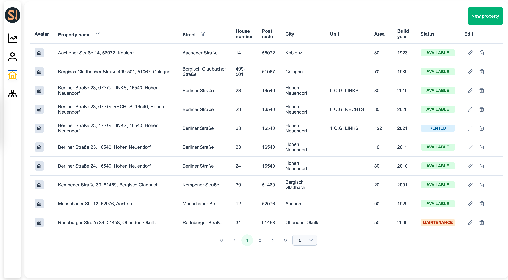
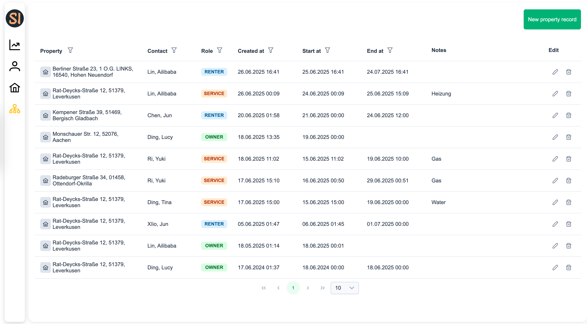
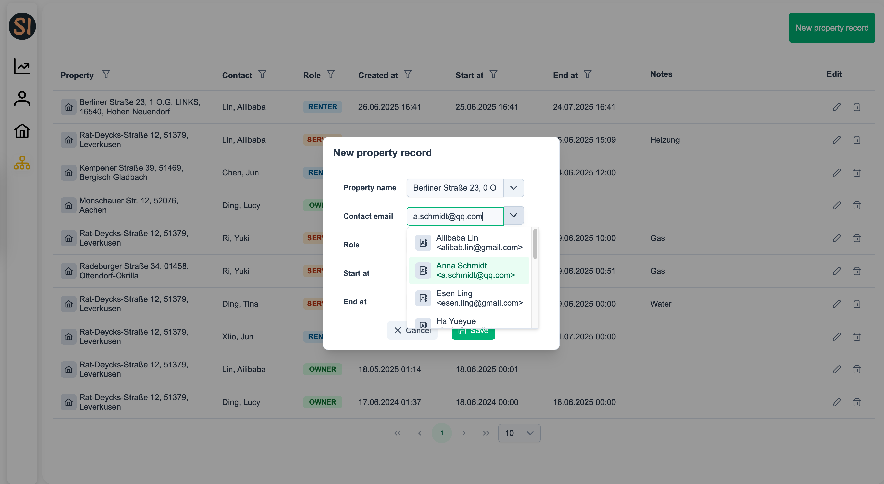

# sb-immo

<p align="center">
  <a ></a>
</p>

### Setup

The backend is based on PostgreSQL with NestJS. Please set up the database first, preferably using Docker.

😉 You can quickly deploy and start the project using the code below, please make sure you have Docker.

```bash
docker run -d \
--name dev-postgres-immo \
-e POSTGRES_USER=sa \
-e POSTGRES_PASSWORD=123 \
-e POSTGRES_DB=sb-immo \
-p 3031:5432 \
postgres:latest
```

# sb-immo-frontend

To start the backend, run:

```bash
cd sb-immo-backend && npm run start:dev
```

To start the frontend UI, please open new terminal under root and run:

```bash
cd sb-immo-frontend && ng serve
```

### UI

##### Relevant contacts


##### Property



##### Property record



##### Create property record



# sb-immo-backend with NestJs

##### Swagger API

👉👉 [OPEN SWAGGER API](http://localhost:3000/api)


